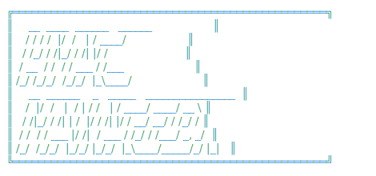

<div align="center">



[](https://www.nuget.org/packages/HmacManager/) [](https://www.nuget.org/packages/HmacManager/) [](https://www.npmjs.com/package/hmac-manager) [](https://hub.docker.com/r/zills/hmac-manager) [](https://hub.docker.com/r/zills/hmac-manager) [](https://artifacthub.io/packages/search?repo=zills) [](https://github.com/jzills/hmac-manager/actions/workflows/pr.yml) [](LICENSE)

_Secure HMAC request authentication for ASP.NET Core — as a NuGet library, or as a containerized Istio ext-authz service for Kubernetes._

</div>

- [Summary](#summary)
- [Features](#features)
- [Installation](#installation)
- [Kubernetes (Istio ext-authz)](#kubernetes-istio-ext-authz)
- [Documentation](./src/README.md)
- [Client Library](./client/)
- [Resources](#resources)

## Summary

Add secure HMAC request authentication to ASP.NET Core APIs with lightweight, configurable middleware.

## Features

- Facilitates detailed policy configuration, enabling applications to sign and verify Hmacs against multiple policy criteria.
- Each policy can optionally define specific schemes, outlining the required header values for a request.
    - Including automatic claims mapping from header values defined in a scheme.
- Supports policy modification at runtime.
    - Including both an option to use a singleton or the preferred approach to use an accessor that can pull policies dynamically from a database or some other data store.
- Incorporates automatic nonce management to protect against replay attacks.
- Integrates with ASP.NET Core authorization mechanisms.

## Installation

`HmacManager` is available on [NuGet](https://www.nuget.org/packages/HmacManager/). 

    dotnet add package HmacManager

## Kubernetes (Istio ext-authz)

Beyond the .NET library, HmacManager ships a containerized verification service and a Helm chart for enforcing HMAC authentication at the mesh edge. The service runs as an [Envoy ext-authz](https://www.envoyproxy.io/docs/envoy/latest/api-v3/extensions/filters/http/ext_authz/v3/ext_authz.proto) HTTP server: an Istio ingress gateway or ambient waypoint calls it before forwarding a request, and anything without a valid HMAC signature is rejected with `403`. Redis is bundled for replay protection — no external dependencies to provision.

```bash
helm repo add zills https://jzills.github.io/hmac-manager
helm repo update
helm install hmac-manager zills/hmac-manager \
  --namespace hmac-system --create-namespace \
  --set "policies[0].name=MyPolicy" \
  --set "policies[0].publicKey=00000000-0000-0000-0000-000000000001" \
  --set "policies[0].privateKeySecret.name=my-hmac-secrets" \
  --set "policies[0].privateKeySecret.key=MyPolicy-privateKey"
```

- **Helm chart** — [kubernetes/chart](kubernetes/chart/README.md) · [Artifact Hub](https://artifacthub.io/packages/search?repo=zills)
- **Container image** — [zills/hmac-manager](https://hub.docker.com/r/zills/hmac-manager) on Docker Hub

## Resources

- [Documentation](src/README.md)
- [Samples](samples/README.md)
